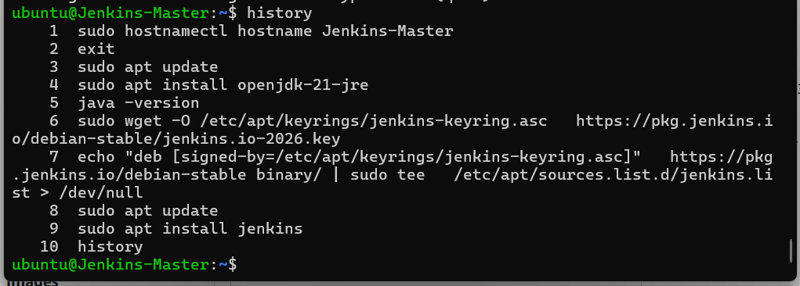
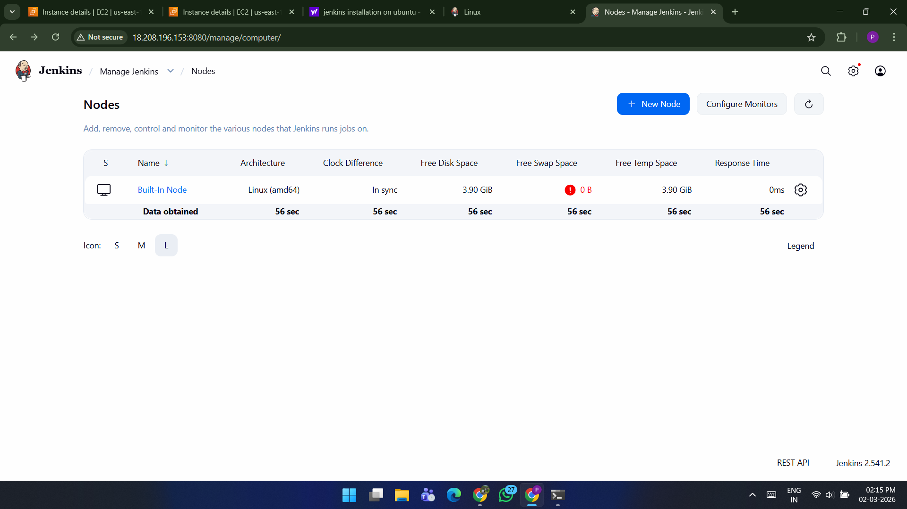
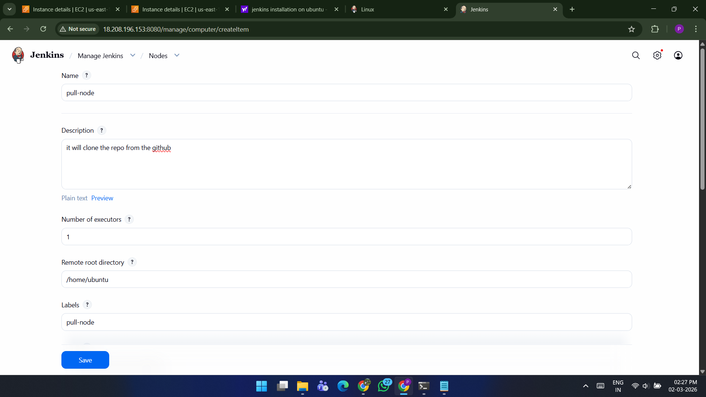
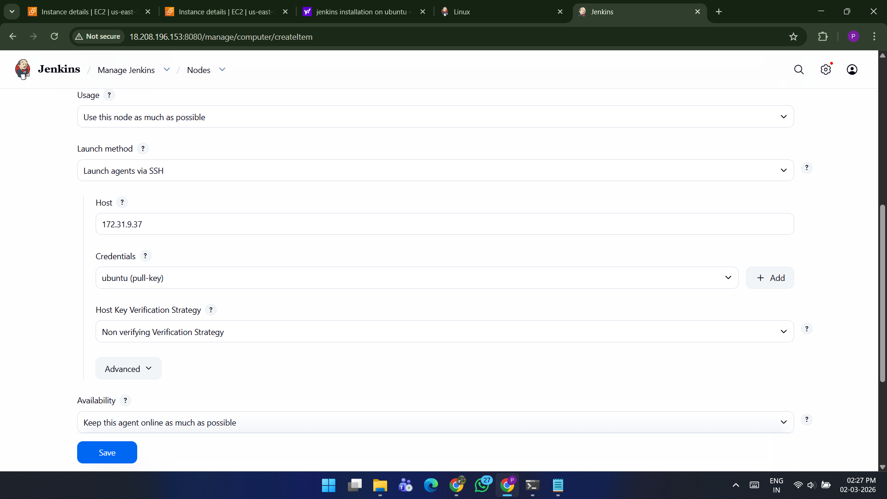

# Jenkins Master–Slave Architecture Setup using AWS EC2

##  Project Overview

In this project, I implemented **Jenkins Master–Slave Architecture** using AWS EC2 instances.

The goal of this project was to understand how Jenkins distributes build workloads using **worker nodes (agents)** instead of executing all jobs on the Jenkins master.

In this setup:

- Jenkins **Master** manages jobs, plugins, UI, and scheduling.
- Jenkins **Worker Node (Slave)** executes the build tasks.
- The worker node clones a repository from **GitHub** using Jenkins.

This architecture is commonly used in **large CI/CD environments** to improve scalability and performance.

---

#  Architecture


### Components Used

- **AWS EC2 Instances**
- **Jenkins Master**
- **Jenkins Worker Node (Agent)**
- **GitHub Repository**
- **SSH Communication**

---

#  Step-by-Step Implementation

---

# Step 1: Launch Jenkins Master EC2 Instance

Create an EC2 instance with the following configuration.

**Instance Name**


Jenkins-master


**Operating System**


Ubuntu


**Security Group Ports**


22 (SSH)
8080 (Jenkins UI)
20


SSH into the instance.


ssh -i key.pem ubuntu@public-ip


---

# Step 2: Install Java and Jenkins on Master
```bash
sudo hostnamectl hostname Jenkins-Master
exit
sudo apt update
sudo apt install openjdk-21-jre
java -version
sudo wget -O /etc/apt/keyrings/jenkins-keyring.asc https://pkg.jenkins.io/debian-stable/jenkins.io-2026.key
echo "deb [signed-by=/etc/apt/keyrings/jenkins-keyring.asc]" https://pkg.jenkins.io/debian-stable binary/ | sudo tee /etc/apt/sources.list.d/jenkins.list > /dev/null
sudo apt update
sudo apt install jenkins
history 
```



http://public-ip:8080


---

# Step 3: Launch Worker Node EC2 Instance

Create another EC2 instance.

**Instance Name:** Jenkins-node

**Operating System:** Ubuntu

**Key Pair:** Same key pair used for Jenkins master

**Security Group Ports:** 22, 8080, 20

SSH into the worker node.

ssh -i key.pem ubuntu@public-ip


---

# Step 4: Install Java on Worker Node

```bash
sudo hostnamectl hostname Jenkins-Worker
exit
sudo apt update
sudo apt install openjdk-21-jre
java -version
history

```
Java is required because Jenkins agents run using Java.

---

# Step 5: Install Required Jenkins Plugins

**Login to Jenkins.**

Navigate to:


Manage Jenkins → Plugins


### Install the following plugins:

- Git Plugin
- SSH Build Agents Plugin

### These plugins allow Jenkins to:

- Clone GitHub repositories
- Connect to worker nodes via SSH

---

# Step 6: Configure Worker Node in Jenkins

Navigate to:


#### Manage Jenkins → Nodes


### You will see:


Built-in Node


This represents the Jenkins master.



### Click:
New Node

**Configure the node.**

```bash

**Node Name**

pull-node

**Type**

Permanent Agent

Node Configuration:

Description: It will clone the repo from GitHub

Remote Root Directory: /home/ubuntu

Label: pull-node

Usage: Use this node as much as possible

Launch Method: Launch agent via SSH

Host: Private IP of worker node
```



---

# Step 7: Configure Credentials

Add credentials for SSH connection.

```bash
Domain: Global Credentials
Kind: SSH Username with Private Key
Scope: Global
ID: pull-key
Username: ubuntu

Paste the **private key** used for the EC2 instance.

Availability

Keep this agent online as much as possible


Save the configuration.
```


---

# Step 8: Verify Agent Connection

After saving the node configuration, Jenkins will connect to the worker node.


If you SSH into the worker node, you will see:

```bash
remoting

remoting.jar
```


These files are used for Jenkins agent communication.

---

# Step 9: Create Jenkins Job

**Create a new job.**


Job Name: pull-job-on-worker-node
Type: Freestyle Project


Description:
This job will clone the GitHub repository on the worker node.


Because the **SSH Build Agents plugin** is installed, Jenkins provides the option:
#### Restrict where this project can be run


Set the label:
pull-node


### This ensures the job runs on the worker node.


---

# Step 10: Configure Source Code Management

Navigate to:


Source Code Management → Git


Repository URL: 
https://github.com/pratik-ghondage/node-js-app-CICD.git


Branch: master

#### Save the job.

---

# Step 11: Build the Job

Click:


Build Now


Jenkins master schedules the job and sends it to the worker node.

The worker node clones the repository from GitHub.

---

# Step 12: Verify the Build

Check the Jenkins workspace.


### Workspace → pull-job-on-worker-node


The repository files will be visible.

If you SSH into the worker node, you will see:

```bash
remoting
remoting.jar
workspace/pull-job-on-worker-node
```


This confirms that the job successfully executed on the worker node.

---

#  Conclusion

In this project, I successfully implemented **Jenkins Master–Slave architecture using AWS EC2 instances**.

The Jenkins master manages jobs and scheduling, while the worker node executes the build tasks. By using SSH-based communication, Jenkins can securely connect to agents and distribute workloads across multiple nodes.

This architecture improves **scalability, performance, and flexibility** in CI/CD pipelines and is widely used in real-world DevOps environments.